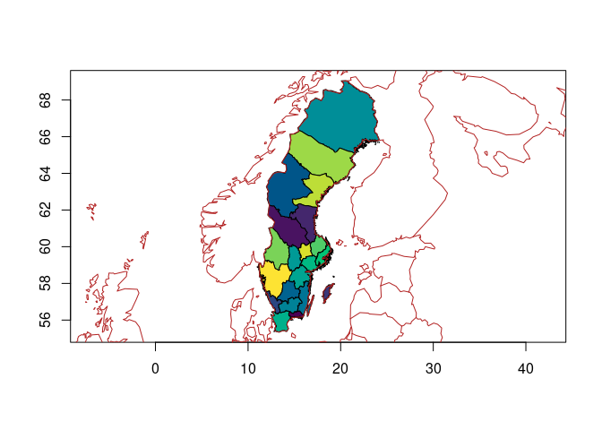

<!-- README.md is generated from README.Rmd. Please edit that file -->

# geobs

<!-- badges: start -->

[](https://github.com/mdsumner/geobs/actions/workflows/R-CMD-check.yaml)
<!-- badges: end -->

The goal of geobs is to get geo boundaries.

## Installation

You can install the development version of geobs from
[GitHub](https://github.com/) with:

``` r
# install.packages("devtools")
devtools::install_github("mdsumner/geobs")
```

## Example

use `unique(countrycode::codelist_panel$iso3c)` to get the codes.

``` r
library(geobs)
## basic example code
x <- get_bounds("SWE")
lat <- mean(as.matrix(wk::as_xy(geos::geos_centroid(x$geometry)))[, 2])
plot(x$geometry, col = palr::d_pal(x$shapeName), asp = 1/cos(lat * pi/180))
maps::map(add = TRUE, col = "firebrick")
```



## Code of Conduct

Please note that the geobs project is released with a [Contributor Code
of
Conduct](https://contributor-covenant.org/version/2/1/CODE_OF_CONDUCT.html).
By contributing to this project, you agree to abide by its terms.
